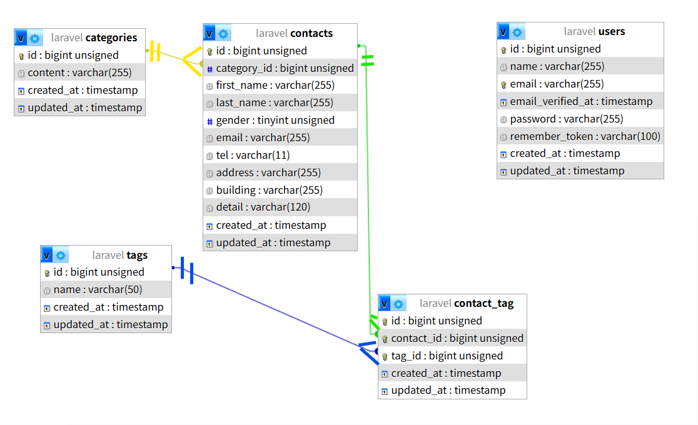
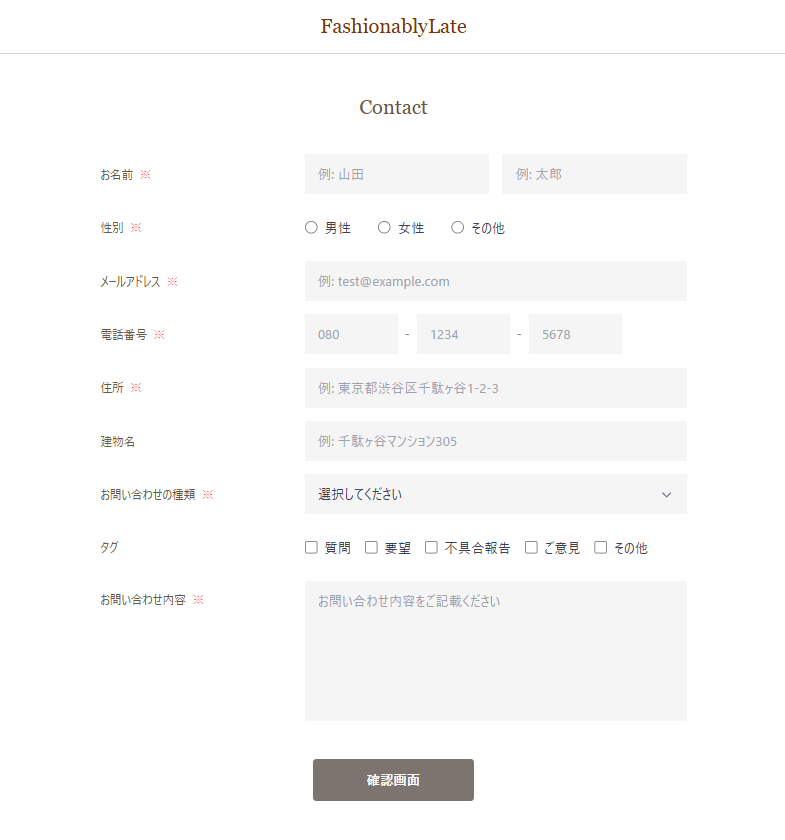
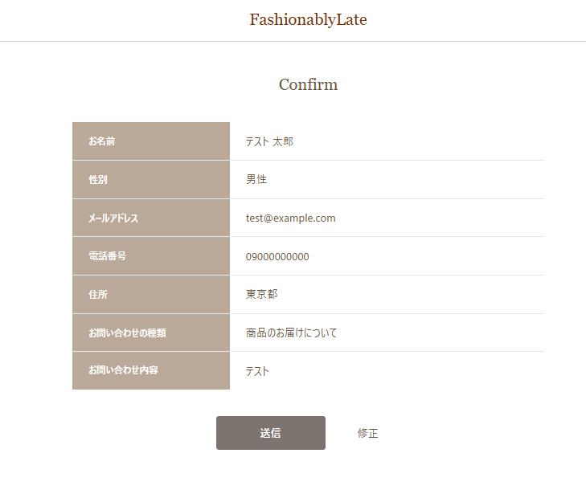
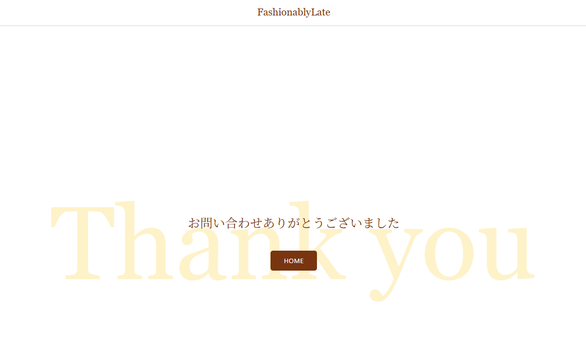
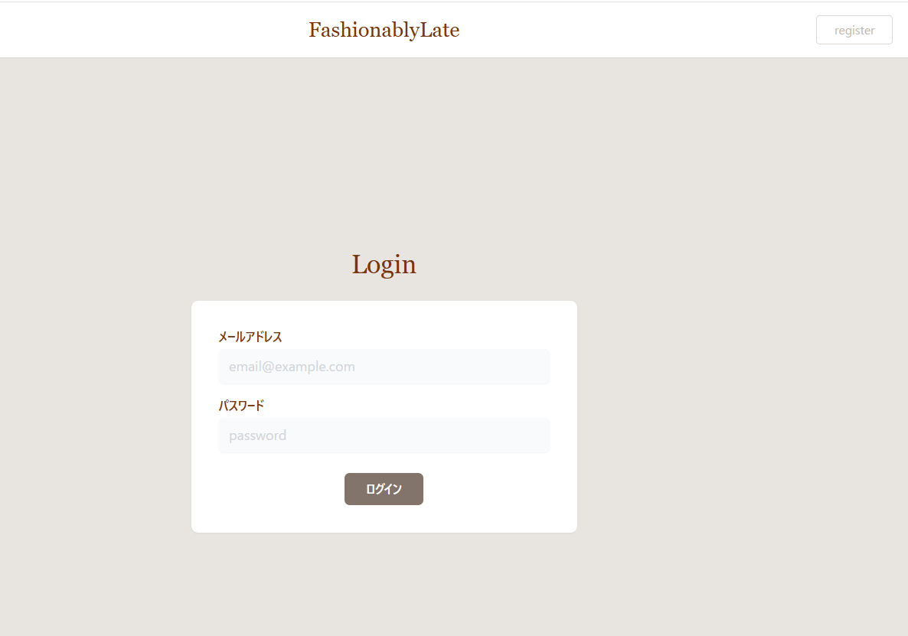
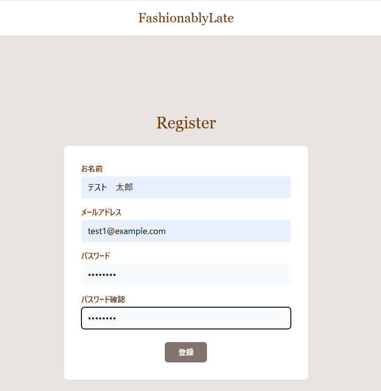
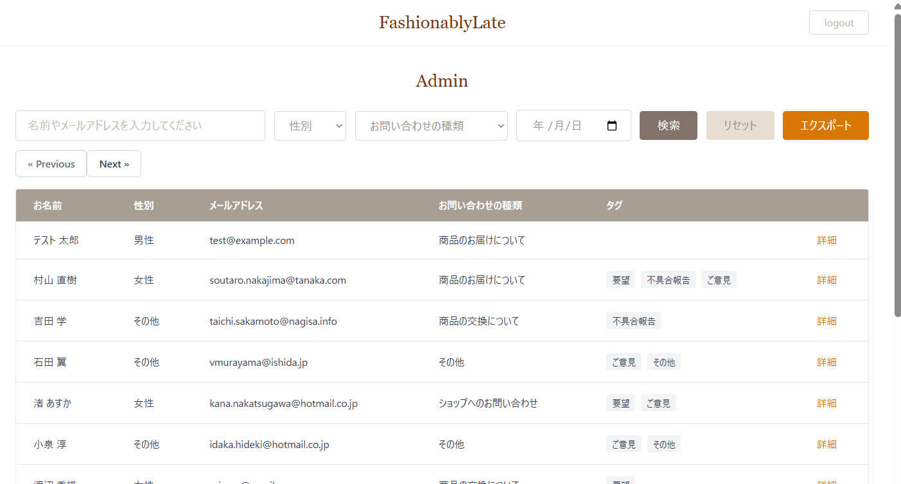

# COACHTECH お問い合わせフォーム

## 概要

目的：確認テストを通して、教材で学んだバックエンド技術（Laravel, DB設計, テスト）を実践的にアウトプットし、復習箇所を洗い出すこと<br>
作成物：coachtech お問い合わせフォーム<br>
【システム概要】<br>
本システムは、一般ユーザーが利用する公開のお問い合わせフォームです。<br>
誰でもお問い合わせを送信でき、管理者はログイン後にその内容を確認・管理します。<br>

## ER図



## 環境構築手順

### 1. git cloneを実行

Dockerが起動していることを確認<br>

```bash
# ホームディレクトリに移動
cd ~

# git cloneを実行
git clone https://github.com/yuna-genma/contact-form-app.git
```

### 2. セットアップ

```bash
# プロジェクトディレクトリに移動
cd contact-form-app


# Laravel Sailをインストール
docker run --rm \
    -u "$(id -u):$(id -g)" \
    -v "$(pwd):/var/www/html" \
    -w /var/www/html \
    -e COMPOSER_CACHE_DIR=/tmp/composer_cache \
    laravelsail/php82-composer:latest \
    composer require laravel/sail --dev

# Sailの設定ファイルをパブリッシュ（MySQLを選択）
docker run --rm \
    -u "$(id -u):$(id -g)" \
    -v "$(pwd):/var/www/html" \
    -w /var/www/html \
    -e COMPOSER_CACHE_DIR=/tmp/composer_cache \
    laravelsail/php82-composer:latest \
    php artisan sail:install --with=mysql

# 環境設定ファイルをコピー
cp .env.example .env

```

### 3. エイリアス設定

```bash
echo "alias sail='[ -f sail ] && bash sail || bash vendor/bin/sail'" >> ~/.bashrc
exec $SHELL
```

※↓このコードでもエイリアス設定できるが、 Laravelプロジェクトのルートディレクトリ（一番上の階層）にいる時しか動かないため注意が必要

```bash
alias sail="./vendor/bin/sail"
```

### 4. フロントエンドのセットアップ

1. Sailの起動

    ```bash
    sail up -d
    ```

2. NPM依存パッケージのインストール

    ```bash
    sail npm install
    ```

3. Tailwind CSSのインストール

    ```bash
    sail npm install -D tailwindcss@^3.4.0 postcss autoprefixer
    sail npm install alpinejs
    ```

4. 設定ファイルの生成

    ```bash
    sail npx tailwindcss init -p
    ```

5. Tailwind CSSのテンプレートパス設定
   `tailwind.config.js`を開き、`content`プロパティを以下のように設定されているか確認

    ```php
    /** @type {import('tailwindcss').Config} */
    export default {
    content: [
     "./resources/**/*.blade.php",
     "./resources/**/*.js",
     "./resources/**/*.vue",
    ],
    theme: {
     extend: {},
    },
    plugins: [],
    }
    ```

6. Vite開発サーバーの起動
   新しいターミナルを開いて実行する。
   ※このコマンドは開発中、常に実行したままにする。
    ```bash
    sail npm run dev
    ```

### 5. envファイルとphpMyAdminの設定

1.  .envファイルの確認<br>
    `.env`ファイルを開き、データベース接続情報が以下と一致していることを確認する<br>
    一致しない場合は以下の情報に書き換える

```php
 DB_CONNECTION=mysql
 DB_HOST=mysql
 DB_PORT=3306
 DB_DATABASE=laravel
 DB_USERNAME=sail
 DB_PASSWORD=password
```

2.  `compose.yaml`を開き、`mysql`サービスの後に以下の設定と一致するか確認する。<br>
    一致しない場合は以下の情報を追加して保存する。

    ```php
     phpmyadmin:
         image: 'phpmyadmin:latest'
         ports:
             - '${FORWARD_PHPMYADMIN_PORT:-8080}:80'
         environment:
             PMA_HOST: mysql
             PMA_USER: '${DB_USERNAME}'
             PMA_PASSWORD: '${DB_PASSWORD}'
         networks:
             - sail
         depends_on:
             - mysql
    ```

### 6. Sailの起動

1. Sailの再起動

    ```bash
    sail down
    sail up -d
    ```

2. アプリケーションキーの生成
    ```bash
    sail artisan key:generate
    ```

### 7. 動作確認

1. Laravelの動作確認<br>
   ブラウザで`http://localhost/`にアクセスする。<br>
   以下のお問い合わせフォーム入力ページが表示されるか確認
   

2. phpMyAdminの動作確認<br>
   ブラウザで`http://localhost:8080`にアクセスする。
   phpMyAdminが表示されることを確認

3. マイグレーションの実行
    ```bash
    sail artisan migrate:refresh --seed
    ```
    phpMyAdminで`users`、`contacts`、`categories`、`tags`テーブルが作られていること・各々に初期データが入力されていることを確認する。

## 使用技術

- Laravel 10
- MySQL 8.0
- Nginx
- Docker
- phpMyAdmin
- Laravel Fortify

## APIエンドポイント一覧

## 開発環境URL

`http://localhost`

## 機能確認手順

### ブラウザでの動作確認

#### お問い合わせフォーム

1. ブラウザで`http://localhost/`にアクセスし、以下の画面が表示されることを確認する。<br>
   

2. 必須入力項目入力後、確認ページへ遷移するのを確認する。<br>
   修正ボタンで前ページへ戻ることができることを確認する。<br>
   

3. 確認画面の送信ボタンでサンクスページに遷移する<br>
   phpMyAdminで入力内容がデータベースに保存されているか確認する。<br>
   

#### 管理者画面

1. ブラウザで`http://localhost/admin`にアクセスする。<br>
   以下のようなログイン画面が表示される<br>
   
2. ログイン画面右上の「register」ボタンで管理者登録画面へ遷移する。<br>
   
3. 登録画面ですべての項目を入力し、登録ボタンを押すと以下の管理画面へ遷移する。<br>
   
    - お問い合わせ項目「詳細」ボタンで詳細ページに遷移。<br>
      「一覧へ戻る」で管理画面に戻り、「削除」ボタンで管理画面にリダイレクトされ、項目削除されていることを確認する。
    - 新しいタグの名前を入力し、「追加ボタン」で追加できることを確認する。
    - タグの「編集」ボタンでタグ編集ページへ遷移する。<br>
      「戻る」ボタンで管理画面に戻り、「更新」ボタンで管理画面にリダイレクトされ、タグ名が更新されているか確認する。
    - タグの「削除」ボタンで管理画面にリダイレクトされ、項目削除されていることを確認する。

### テストでの機能確認

```bash
   # プロジェクトディレクトリに移動
   cd contact-form-app

   # 全てのテストを実行
   sail test
```

全てのテストがpassすることを確認する。

#### カバレッジレポートの確認

1. `.env`ファイルに以下の行を追加

```bash
   XDEBUG_MODE=coverage
```

2. コンテナを再起動して設定を反映する。

```bash
   sail down
   sail up -d
```

3. Vite開発サーバーを起動(別のターミナルタブで実行)

```bash
   sail npm run dev
```

4. カバレッジレポートの生成

```bash
   # HTMLレポートを生成
   sail test --coverage-html=coverage

   # ターミナルに概要を表示
   sail test --coverage
```

`Total: 75.9 %`と表示されることを確認する。

## 作成者

源馬　友奈
